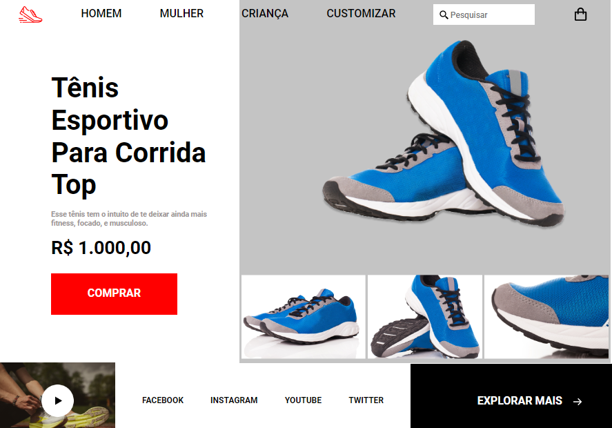

## 💻 Projeto

 Desafio consistiu em criar um mini e-commerce de calçados esportivos. Utilizando HTML e CSS.

## 🚀 Tecnologias

<ul>
  <li>HTML</li>
  <li>CSS</li>
</ul>

## 🔖 Layout do Projeto

O layout pode ser visto através do Figma

[Layout Web](https://www.figma.com/file/Kl5MtmImGvTJrFznOZ3VrY/DD-%2F-RocketShoes-(Copy))
